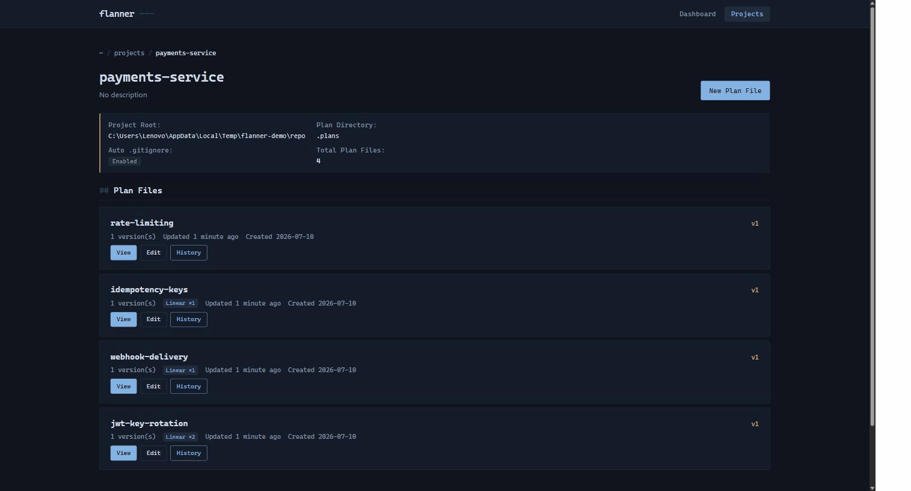
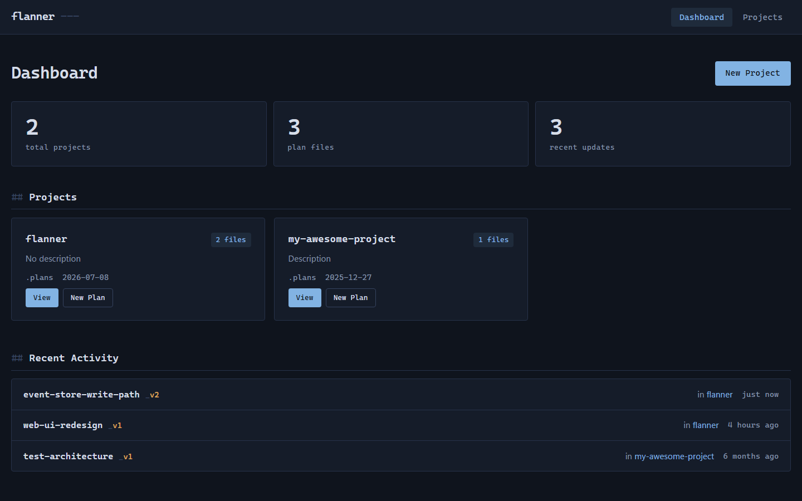

# Flanner

[](https://pypi.org/project/flanner/)
[](https://pypi.org/project/flanner/)
[](https://github.com/jaysonmulwa/flanner/actions/workflows/ci.yml)
[](LICENSE)

<!-- mcp-name: io.github.jaysonmulwa/flanner -->

A plan-file manager for AI coding agents, wired into Claude Code and other assistants over MCP (Model Context Protocol).

<div align="center">

</div>

## Why

AI agents write markdown constantly: design docs, migration plans, architecture notes. It piles up fast, scattered across your repo, quietly going stale, and easy to commit by accident. Flanner gives those files one home, versions them automatically as the agent revises, and keeps them out of git until you decide otherwise, with a browsable reading view and an audit trail on top.

## No, I'm not convinced. But why?

Those plan files pile up in two directions at once: scattered across your projects locally, and scattered across open issues in your project-management tool. Flanner is the choke point for both, keeping you organized on disk and linked to the issue each plan belongs to.

Flanner is local-first, and stays that way when a team uses it. Plans sync directly between your machines over an encrypted connection — there is no server holding them, and no upload step. The hosted side ([Flanner Mesh](https://flanner.io/mesh)) issues identities and decides who may read what; it never sees plan contents and could not read them if it wanted to. Next after that: clean links out to the tools teams already work in, from product trackers and chat to second brains like Notion.

## Features

- **MCP integration**: exposes plan-file tools to Claude Code and Codex.
- **Automatic headers and versioning**: every plan gets YAML frontmatter, and each revision is a new version with a full history.
- **Git protection**: plans live in `.plans/` and are kept out of commits automatically.
- **Agent integration**: `flanner init` wires CLAUDE.md, AGENTS.md, and a guard hook so agents save plans through flanner instead of scattering raw markdown.
- **Issue tracker links**: tie a plan to its Linear (or JIRA) issue; with a `LINEAR_API_KEY`, flanner verifies the issue and shows its live state, in the CLI and the dashboard.
- **Reading view**: a browser dashboard to read, edit, and walk the history of plans (light and dark, fully offline).
- **Per-project config**: customize the plan directory per repository.

## Quick start

```bash
pip install flanner

cd your-project      # a git repo where plans should live
flanner init         # sets up the database, MCP registration, and a project
```

Then ask your agent to work with plans:

> "Create an architecture plan for the auth service"
>
> "Show me the history of the architecture plan"

And open the dashboard to browse them:

```bash
flanner web --open-browser     # http://localhost:8080
```

`flanner init` is safe to re-run. It detects your git root, creates `.plans/`, updates `.gitignore`, registers the MCP server with Claude Code, and installs the agent integration.

## CLI commands

```bash
flanner init [--project-root PATH] [--plan-dir DIR]     # set up a project
flanner status                                          # projects, plan files, db path
flanner list [--project NAME] [--output json]           # list projects or a project's plans
flanner sync [--project NAME] [--dry-run]               # import existing .plans/ files
flanner config NAME [--plan-dir DIR] [...]              # change project settings
flanner web [--port 8080] [--host 127.0.0.1] [--open-browser]
flanner register [--force] / flanner unregister         # MCP registration with Claude Code
flanner claude-info                                     # integration status
```

<details>
<summary><b>Plan file format</b></summary>

Every managed plan carries YAML frontmatter, generated by the tools and never hand-written:

```markdown
---
mcp_plan_file: true
project_id: 3d816ecd-489a-4fa0-abe2-15ec93f60d5a
plan_file_id: 59c34f9c-8471-47fc-97f2-8dcfefa15434
plan_name: architecture
version: 2
created_by: claude
---

# Architecture Plan

Your plan content here...
```

</details>

<details>
<summary><b>Web interface</b></summary>



A server-rendered dashboard, no build step, works offline:

- Dashboard (`/`): projects, stats, and recent activity
- Project detail (`/projects/{id}`): a project's plans, paginated
- Plan viewer (`/plans/{id}`): rendered markdown, version selector, frontmatter
- Editor (`/plans/{id}/edit`) and version history (`/plans/{id}/history`)

The web UI binds `127.0.0.1` with no authentication. Do not expose it beyond localhost.

</details>

<details>
<summary><b>Where data lives</b></summary>

- Catalog (SQLite): `~/.flanner/data.db`, override with `FLANNER_HOME` or `FLANNER_DB_PATH`
- Plan files: `.plans/` in your repo, git-ignored, named `name_v1.md`, `name_v2.md`, and so on

</details>

<details>
<summary><b>Issue tracker links (Linear, JIRA)</b></summary>

Link plan files to issues so a plan and its ticket travel together.

```bash
flanner linear auth                                     # verify LINEAR_API_KEY, print MCP snippet
flanner linear config PROJECT --workspace acme          # linear.app/acme
flanner linear link PLAN --issue ENG-123 [--notes ...]  # link a plan to an issue
flanner linear links [--project PROJECT]                # list all links
flanner linear show PLAN [--project PROJECT]            # links for one plan
flanner linear unlink PLAN [--issue ENG-123 | --all]
flanner linear refresh PLAN                             # re-pull title/state (needs API key)
```

With `LINEAR_API_KEY` set, `link` verifies the issue exists and caches its title
and state, `--attach-url` attaches a URL to the Linear issue, and `refresh`
re-pulls live status. Without a key it stays link-only (stores the id, builds
the URL). The key is read from the environment only, never stored on disk. See
[docs/LINEAR_INTEGRATION.md](docs/LINEAR_INTEGRATION.md). A parallel `flanner jira`
group links to JIRA issue keys (link-only).

</details>

<details>
<summary><b>Syncing plans between devices</b></summary>

```bash
flanner peer serve                                      # answer authorised peers
flanner peer pull <device-id>                           # pull what a peer holds
flanner peer status [<device-id>]                       # how this device is reached
```

`peer serve` opens no listening port. It dials out and answers on that
connection, so it needs no port forwarding, no VPN and no administrator
rights. Devices find each other by public key rather than by address.

Being reachable grants nothing. A caller needs a signed request and an
entitlement naming both its device and the workspace, and every artifact
received is checked against its *author's* key, not the peer that handed it
over. So a peer you sync with is not a peer you trust.

`peer status` answers the question a slow sync raises: direct or relayed?
Both work. A relay is slower, and usually means a firewall that refuses to
be punched through.

Connections go direct where possible and relay only where they must. Pass
an http address instead of a device id to reach a peer already on your
network, which needs `flanner peer serve --http` on the other side.

**Platforms.** Reaching a peer that has no address needs the `iroh`
transport, which publishes builds for macOS on Apple Silicon, Linux on
x86-64 and arm64, and Windows on x86-64. It is declared only for those, so
`pip install flanner` works everywhere; elsewhere it is simply absent and
`flanner peer status` says so. Everything else in flanner is unaffected,
and peers on a shared network still sync over an address.

Alpine and other musl distributions are the exception: the Linux build does
not match there, so the install fails rather than skipping it. Use a
glibc-based image, or install with `--no-deps` and add the remaining
dependencies yourself.

</details>

<details>
<summary><b>Architecture</b></summary>

Layering is enforced by `tests/test_architecture.py`:

- **foundation** (`exceptions`, `utils`, `frontmatter`, `git_integration`, `jira_utils`, `linear_utils`) imports nothing else from the package; the `linear_api` GraphQL client adds only `exceptions`
- **data** (`database`, `storage`) sits on the foundation only
- **composition roots** (`server` for MCP, `web`, `cli`) wire everything together and do not import each other (except `cli`, which launches both)

Decisions are recorded in [docs/adr/](docs/adr/), with more guides in [docs/](docs/).

</details>

## Performance

Measured on Windows AMD64, Python 3.13.1, SQLite on a local SSD. Reproduce
with `python benchmarks/bench.py`.

| Operation | Median | Scale |
|-----------|--------|-------|
| `create_project` | 44 ms | one project |
| `create_plan_file` | 79 ms | n=100, ~2.4 KB body each |
| `list_plan_files` | 4.7 ms | 100 plans, n=20 |

**Cold start is slower than it should be, and this is the honest number:**

| Command | Median (n=5) |
|---------|--------------|
| `flanner --version` | 1470 ms |
| `flanner --help` | 1470 ms |
| `flanner list` | 1760 ms |

A CLI should answer a simple command in under 500 ms, and this does not.
Profiled with `python -X importtime`, the cost is import time before any
command runs: 182 ms is the Python interpreter, ~120 ms click and rich,
~680 ms SQLAlchemy, and the remaining ~1.2 s is flanner's own modules being
imported eagerly whether a command needs them or not.

Fixing it means loading command implementations on demand rather than at
import. That is a structural change and it has not been made, so the number
above is what you get today.

## Exit codes

Scripts need to tell "fix your command" from "this machine is broken", so
the two are different codes:

| Code | Means | Retrying helps? |
|------|-------|-----------------|
| `0` | It worked | — |
| `1` | You asked for something that cannot be done: no such project, no access, a workspace id that is not yours | Only after you change the command |
| `2` | The machine underneath failed: disk, permissions, a store that will not open | No |

## How it works

An agent calls `get_plan_config` to learn where plans go, then `create_plan_file_tool` or `update_plan_file_tool` to write them. Flanner places the file in the project's plan directory, adds the header, and bumps the version. Files stay in `.plans/` (git-ignored), so they never land in a commit by accident.

**Nothing is pruned, and nothing is erased.** Every version, comment and review decision is kept. The store is append-only, there is no cleanup command, and the Settings page shows what that costs in bytes so the choice is visible rather than assumed. Deletion follows from the same design: `flanner retire <plan>` asks every peer to stop showing and serving a plan, and `--restore` undoes it, but it is a claim other devices honour rather than an erasure. A teammate who was offline when you ran it keeps the content until they next sync, and anyone already holding the bytes keeps them. That is the strongest promise an append-only store spread across machines you do not control can honestly make, so it is the one made here.

**Keeping the agent on the rails.** The MCP tools are the *how*; `flanner init` also installs two layers that make the agent actually use them. It writes a managed block into `CLAUDE.md` and `AGENTS.md` (guidance Claude Code and Codex read every session) plus a `flanner-plan` skill, so the agent knows to route plan docs through flanner. On top of that, a `guard-write` PreToolUse hook denies any raw write into the plan directory and points the agent back to `create_plan_file_tool`, so even if it ignores the guidance a plan cannot land as unmanaged markdown. The hook fails open and never blocks writes elsewhere.

## Roadmap

Shipped in 0.9.0: peer-to-peer sync, shared workspaces, and review between
teammates. Plans move directly between machines; nothing is uploaded. See
[Flanner Mesh](https://flanner.io/mesh) for how that works and what it costs.

Planned next:

- Full-text search across plans
- Links out to product trackers, chat, and second brains like Notion
- Real-time updates in the web UI
- Relay fallback for peers that cannot reach each other directly

There is no plan to host plan contents. The catalog stays on your machine.
That is a design decision, not a milestone waiting to be funded.

## Contributing

Setup, the CI gates, benchmarks, and the release process are in [CONTRIBUTING.md](CONTRIBUTING.md).

## License

MIT
