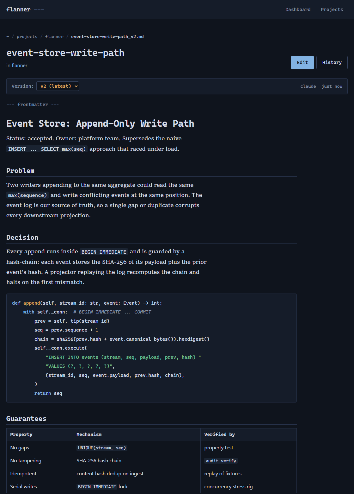

# Flanner

[](https://pypi.org/project/flanner/)
[](https://pypi.org/project/flanner/)
[](https://github.com/jaysonmulwa/flanner/actions/workflows/ci.yml)
[](LICENSE)

A plan-file manager for AI coding agents, wired into Claude Code and other assistants over MCP (Model Context Protocol).

AI agents write markdown constantly: design docs, migration plans, architecture notes. It piles up fast, scattered across your repo, quietly going stale, and easy to commit by accident. Flanner gives those files one home, versions them automatically as the agent revises, and keeps them out of git until you decide otherwise, with a browsable reading view and an audit trail on top.

Today Flanner is local-first; the goal is cloud-hosted plans: shared workspaces for easier collaboration, effectively unlimited storage and history, and clean links to the tools teams already work in, from product trackers and chat to second brains like Notion.

<div align="center">

</div>

## Features

- **MCP integration**: exposes plan-file tools to Claude Code and Codex.
- **Automatic headers and versioning**: every plan gets YAML frontmatter, and each revision is a new version with a full history.
- **Git protection**: plans live in `.plans/` and are kept out of commits automatically.
- **Agent integration**: `flanner init` wires CLAUDE.md, AGENTS.md, and a guard hook so agents save plans through flanner instead of scattering raw markdown.
- **Reading view**: a browser dashboard to read, edit, and walk the history of plans (light and dark, fully offline).
- **Per-project config**: customize the plan directory per repository.

## Quick start

```bash
pip install flanner

cd your-project      # a git repo where plans should live
flanner init         # sets up the database, MCP registration, and a project
```

Then ask your agent to work with plans:

> "Create an architecture plan for the auth service"
>
> "Show me the history of the architecture plan"

And open the dashboard to browse them:

```bash
flanner web --open-browser     # http://localhost:8080
```

`flanner init` is safe to re-run. It detects your git root, creates `.plans/`, updates `.gitignore`, registers the MCP server with Claude Code, and installs the agent integration.

## CLI commands

```bash
flanner init [--project-root PATH] [--plan-dir DIR]     # set up a project
flanner status                                          # projects, plan files, db path
flanner list [--project NAME] [--output json]           # list projects or a project's plans
flanner sync [--project NAME] [--dry-run]               # import existing .plans/ files
flanner config NAME [--plan-dir DIR] [...]              # change project settings
flanner web [--port 8080] [--host 127.0.0.1] [--open-browser]
flanner register [--force] / flanner unregister         # MCP registration with Claude Code
flanner claude-info                                     # integration status
```

<details>
<summary><b>Plan file format</b></summary>

Every managed plan carries YAML frontmatter, generated by the tools and never hand-written:

```markdown
---
mcp_plan_file: true
project_id: 3d816ecd-489a-4fa0-abe2-15ec93f60d5a
plan_file_id: 59c34f9c-8471-47fc-97f2-8dcfefa15434
plan_name: architecture
version: 2
created_by: claude
---

# Architecture Plan

Your plan content here...
```

</details>

<details>
<summary><b>Web interface</b></summary>


A server-rendered dashboard, no build step, works offline:

- Dashboard (`/`): projects, stats, and recent activity
- Project detail (`/projects/{id}`): a project's plans, paginated
- Plan viewer (`/plans/{id}`): rendered markdown, version selector, frontmatter
- Editor (`/plans/{id}/edit`) and version history (`/plans/{id}/history`)

The web UI binds `127.0.0.1` with no authentication. Do not expose it beyond localhost.

</details>

<details>
<summary><b>Where data lives</b></summary>

- Catalog (SQLite): `~/.flanner/data.db`, override with `FLANNER_HOME` or `FLANNER_DB_PATH`
- Plan files: `.plans/` in your repo, git-ignored, named `name_v1.md`, `name_v2.md`, and so on

</details>

<details>
<summary><b>Architecture</b></summary>

Layering is enforced by `tests/test_architecture.py`:

- **foundation** (`exceptions`, `utils`, `frontmatter`, `git_integration`, `jira_utils`) imports nothing else from the package
- **data** (`database`, `storage`) sits on the foundation only
- **composition roots** (`server` for MCP, `web`, `cli`) wire everything together and do not import each other (except `cli`, which launches both)

Decisions are recorded in [docs/adr/](docs/adr/), with more guides in [docs/](docs/).

</details>

## How it works

An agent calls `get_plan_config` to learn where plans go, then `create_plan_file_tool` or `update_plan_file_tool` to write them. Flanner places the file in the project's plan directory, adds the header, and bumps the version. Files stay in `.plans/` (git-ignored), so they never land in a commit by accident.

## Roadmap

Flanner is local-first today. Planned next:

- Cloud-hosted plans: a PostgreSQL catalog and S3-backed storage for effectively unlimited history
- Shared workspaces for team collaboration
- Full-text search across plans
- Links out to product trackers, chat, and second brains like Notion
- Real-time updates in the web UI

## Contributing

Setup, the CI gates, benchmarks, and the release process are in [CONTRIBUTING.md](CONTRIBUTING.md).

## License

MIT
